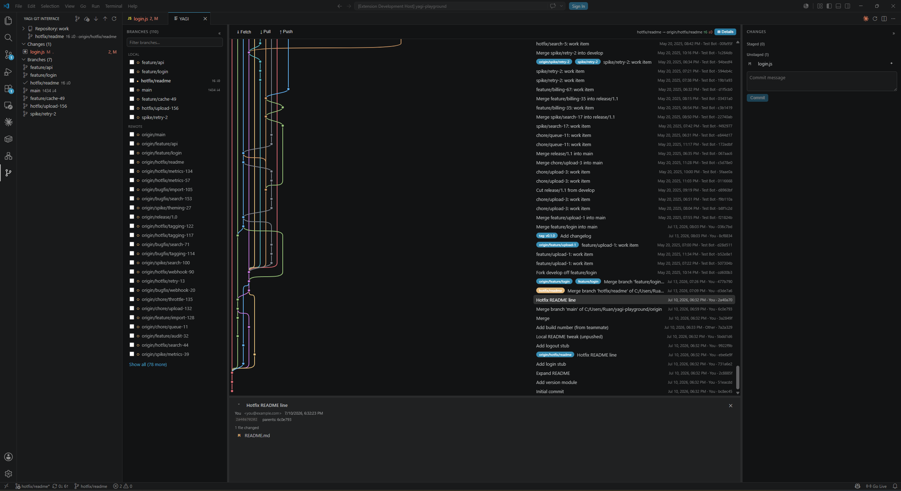

# YAGI — Yet Another Git Interface

**A Fork-style graphical Git client that lives inside VS Code.**

Commit graph. Staging. Merge conflicts. Interactive rebase. Remotes.
No app-switching, no separate window — just your editor.

---

## Why YAGI?

VS Code's built-in Source Control view is great for a quick commit, but the
moment you need to **untangle history**, **resolve a real merge conflict**, or
**rebase interactively**, you reach for a separate app. YAGI closes that gap —
it brings a full, Fork-like Git GUI into an editor tab, wired directly to your
workspace.

- **Stay in one window.** No context switch to a separate Git client.
- **Everything is native underneath.** Diffs open in VS Code's own diff
  editor; conflicts open in its 3-way merge editor. You get YAGI's graph and
  workflow on top of tools you already know.
- **It's just `git`.** Every action shells out to the Git CLI you already
  have installed — no bundled Git, no proprietary format.

## Features

### 📊 Commit graph
A colored-lane commit graph that stays fast on large repositories —
rendering is virtualized, and history loads incrementally as you scroll
("load more" paging), so a 50,000-commit repo opens as quickly as a 50-commit
one.

### 🔗 Squash & rebase-merge tracking
Squash and rebase merges rewrite your branch's commits under new SHAs, so a
normal graph shows no connection back to the branch you merged — it just looks
deleted. YAGI detects these (via patch-id equivalence) and draws a **solid
merge line** to the commit that absorbed the work, with a **"merged"** badge in
both the graph and the branch list. Detection runs off the main thread and is
cached, and can be disabled on very large repos (`yagi.showMergedBranches`).

### 🔍 Commit details
Click any commit to see its full message, author, parents, and changed
files — click a file to open it in VS Code's native diff editor.

### ✅ Staging & commit
Stage and unstage files, view diffs natively, and commit — with `Ctrl/Cmd+Enter`
to commit without leaving the keyboard.

### 🔀 Merge, rebase, cherry-pick, revert
- One-click **merge** and **rebase** from the branch list.
- **Cherry-pick** and **revert** any commit from its context menu.
- A full **interactive rebase** UI — reorder, squash, fixup, or drop commits
  with drag-free up/down controls, no manual todo-file editing.
- Conflicts pause the operation with a clear banner and
  **Continue / Skip / Abort** — conflicted files open directly in VS Code's
  3-way merge editor.

### ☁️ Remotes
Fetch, pull, and push with live ahead/behind indicators. Optionally
auto-pull after any operation finishes, so your view never falls out of
sync with the remote (`yagi.pullAfterOperations`).

### 🗂️ Built for your workflow
- An **Activity Bar sidebar** mirrors the current branch, changed files, and
  full branch tree — for quick actions without opening the full panel.
- **Resizable, collapsible panes** remembered forever, per user.
- A **branch filter** so repositories with 100+ branches stay navigable, with
  the checked-out branch always pinned to the top of the list.
- Automatic **repository discovery**: open a parent folder containing
  several repos and YAGI finds them (or lets you pick).

## Getting started

1. Install **YAGI** from the Marketplace.
2. Open a folder containing a Git repository.
3. Click the **YAGI icon** in the Activity Bar, or run
   **YAGI: Open Git Interface** from the Command Palette.

That's it — no configuration required.

## Settings

| Setting | Default | Description |
|---|---|---|
| `yagi.pullAfterOperations` | `true` | After push, merge, rebase, cherry-pick, or revert, automatically pull the current branch's upstream. |
| `yagi.branchLimit` | `25` | Number of most-recently-updated branches to show per section before "Show all". `0` shows every branch. |
| `yagi.showMergedBranches` | `true` | Detect and draw a merge line for branches squash/rebase-merged into the current branch. Turn off if it's slow on very large repositories. |

## Requirements

- VS Code 1.90 or later
- `git` available on your `PATH`

## Feedback & contributions

YAGI is open source. Bug reports, feature requests, and pull requests are
welcome at [github.com/knoppies999/yagi](https://github.com/knoppies999/yagi).

## License

[MIT](LICENSE)
